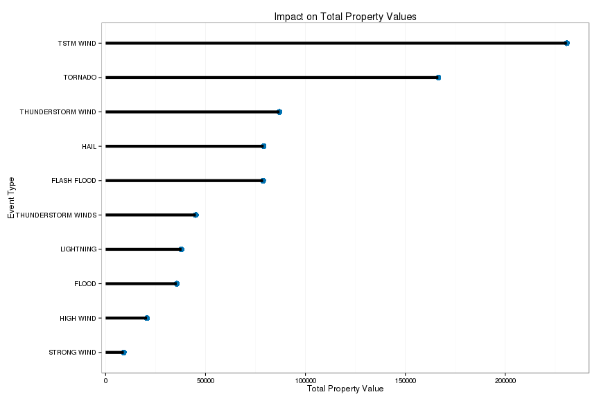
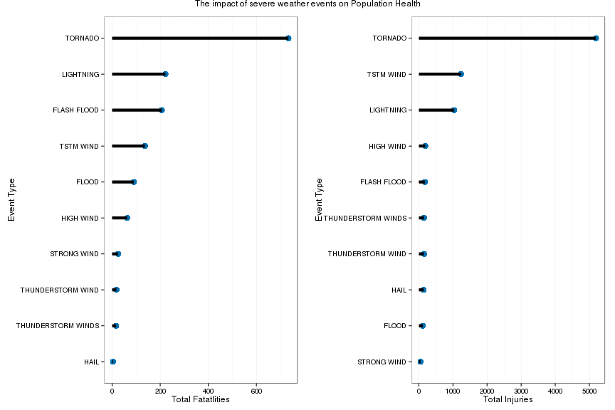
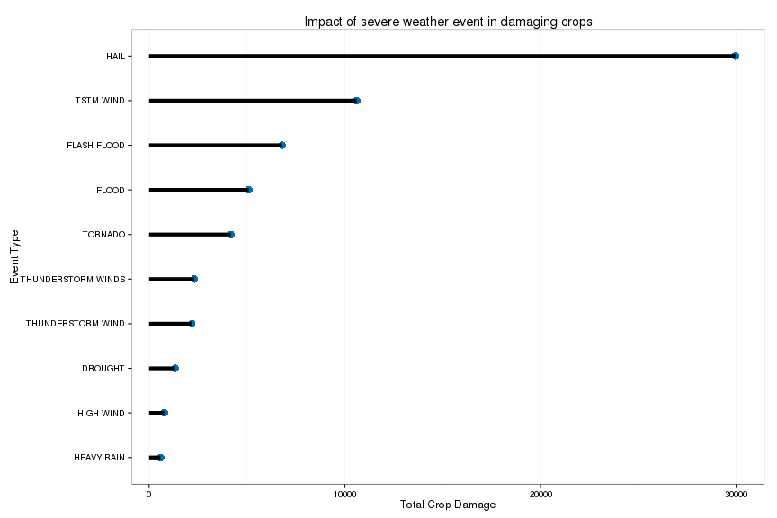

##Synopsis
The current data analysis focus on identifying the most important severe weather conditions which has highest impact on population health and crop damage from the storm data collected from U.S. National Oceanic and Atmospheric Administration's (NOAA) storm database. The NOAA data is collected from year of 1950 to 2011 and has approximately 7.9e6 observations of 37 features. For this analysis we will use property damage, injuries, and fatalities as an indicator for impact on population health resulted due to different severe weather conditions. Further, crop damage variable will be used to identify the weather event which had highest impact on crop damage. The analysis shows that if all the variables are analyzed together tornado has the highest impact on both crop damage and population health. The Hail impacts the crop most. Moreover, flash floods also severely impacted the crops. 

## Loading and Processing the Raw Data
In the section we will filter and process the raw storm data collected from the U.S. National Oceanic and Atmospheric Administration's (NOAA) storm database to find answers for the impact of severe weather conditions on economy and identify most damaging event for the population health. We will carry out three steps of analysis in this section. First, we will load the required libraries in the R work-space. Second, we will filter the required data from the raw data. Third, we will perform the quality check on the data. 

### Load the required libraries
First let us load all the required libraries for the analysis. We will use ggplot2 and gridExtra packages for plotting the results. Finally, we will be using plyr package for processing the data file. 

```r
library(ggplot2)
library(plyr)
library(gridExtra)
```

Next, we are going to read the storm data from local directory or if the data is not available then download the data from the course website. The data is a comma separated value compressed using the bzip2 method to reduce the size. Further information about the data can be found on [National Weather Service Storm Data Documentation](https://d396qusza40orc.cloudfront.net/repdata%2Fpeer2_doc%2Fpd01016005curr.pdf) and [National Climatic Data Center Storm Events](https://d396qusza40orc.cloudfront.net/repdata%2Fpeer2_doc%2FNCDC%20Storm%20Events-FAQ%20Page.pdf). The event data is collected between the years 1950 to 2011. 

```r
if (!"repdata-data-StormData.csv.bz2" %in% list.files()){
  download.file("https://d396qusza40orc.cloudfront.net/repdata%2Fdata%2FStormData.csv.bz2",
                "./repdata-data-StormData.csv.bz2",method="curl"
                ,quiet=TRUE)
}
raw.data<-read.csv("./repdata-data-StormData.csv.bz2",stringsAsFactor=FALSE)
```
### Extracting features from raw data for the required analysis.
Next, the required features for the analysis is filtered from the `raw.data`. After reading through the data file description ([National Weather Service Storm Data Documentation](https://d396qusza40orc.cloudfront.net/repdata%2Fpeer2_doc%2Fpd01016005curr.pdf)) the features of interest are `EVTYPE`, `FATALITIES`, `INJURIES`, `PROPDMG`, `PROPDMGEXP`, `CROPDMG`, and `CROPDMGEXP`. For the first part of analysis regarding impact of events on population health we will use `EVTYPE`,`FATALITIES`, and `INJURIES` variables.  For the second part of analysis to study the impact of severe weather events on the economic consequences we will use features `PROPDMG`, `PROPDMGEXP`, `CROPDMG`, and `CROPDMGEXP`.

```r
filter.data<-raw.data[, 
                      c("EVTYPE", "FATALITIES", "INJURIES",
                        "PROPDMG", "PROPDMGEXP", "CROPDMG","CROPDMGEXP")]
```

### Quality check of the data.
Next, we will do some quality check of the data by checking missing values and cleaning the names of the string variables by making consistent cases and numbers comparable.

```r
# Making case consistent
filter.data$EVTYPE<-toupper(filter.data$EVTYPE)
filter.data$PROPDMGEXP<-toupper(filter.data$PROPDMGEXP)
filter.data$CROPDMGEXP<-toupper(filter.data$CROPDMGEXP)
# Next, check the type of characters in PROPDMGEXP and CROPDMGEXP
unique.propdmgexp<-data.frame("UniqueCharactersinPROPDMGEXP"=
                                unique(filter.data$PROPDMGEXP))
unique.cropdmgexp<-data.frame("UniqueCharactersinCROPDMGEXP"=
                                unique(filter.data$CROPDMGEXP))
print(unique.propdmgexp)
```

```
##    UniqueCharactersinPROPDMGEXP
## 1                             K
## 2                             M
## 3                              
## 4                             B
## 5                             +
## 6                             0
## 7                             5
## 8                             6
## 9                             ?
## 10                            4
## 11                            2
## 12                            3
## 13                            H
## 14                            7
## 15                            -
## 16                            1
## 17                            8
```

```r
print(unique.cropdmgexp)
```

```
##   UniqueCharactersinCROPDMGEXP
## 1                             
## 2                            M
## 3                            K
## 4                            B
## 5                            ?
## 6                            0
## 7                            2
```
As we observe from the output that there are special characters like `?,+,-` and `blank` in the exponential, which will require to be treated separately. Since, these are unknown we replace it by `0` that is as exponent `1e0=1`. This will we will nullify the effect of unknown exponent on the original value in `PROPDMG`. Next, numbers `0-8` will be replace `1e0-1e8` respectively. Similarly for `H-K-M-B` as `1e2-1e3-1e6-1e9` respectively. 

```r
#Replace multipliers by numbers
filter.data$PROPDMGEXP[filter.data$PROPDMGEXP %in% c("1")]<-"1e1"
filter.data$CROPDMGEXP[filter.data$CROPDMGEXP %in% c("1")]<-"1e1"
filter.data$PROPDMGEXP<-gsub("\\+|\\?|\\-","1",filter.data$PROPDMGEXP)
filter.data$CROPDMGEXP<-gsub("\\+|\\?|\\-","1",filter.data$CROPDMGEXP)
filter.data$PROPDMGEXP[filter.data$PROPDMGEXP==""]<-"1"
filter.data$CROPDMGEXP[filter.data$CROPDMGEXP==""]<-"1"
filter.data$PROPDMGEXP[filter.data$PROPDMGEXP %in% c("H","2")]<-"1e2"
filter.data$CROPDMGEXP[filter.data$CROPDMGEXP %in% c("K","2")]<-"1e2"
filter.data$PROPDMGEXP[filter.data$PROPDMGEXP %in% c("K","3")]<-"1e3"
filter.data$CROPDMGEXP[filter.data$CROPDMGEXP %in% c("K","3")]<-"1e3"
filter.data$PROPDMGEXP[filter.data$PROPDMGEXP %in% c("M","6")]<-"1e6"
filter.data$CROPDMGEXP[filter.data$CROPDMGEXP %in% c("M","6")]<-"1e6"
filter.data$PROPDMGEXP[filter.data$PROPDMGEXP %in% c("B","9")]<-"1e9"
filter.data$CROPDMGEXP[filter.data$CROPDMGEXP %in% c("B","9")]<-"1e9"
filter.data$PROPDMGEXP[filter.data$PROPDMGEXP %in% c("7")]<-"1e7"
filter.data$CROPDMGEXP[filter.data$CROPDMGEXP %in% c("7")]<-"1e7"
filter.data$PROPDMGEXP[filter.data$PROPDMGEXP %in% c("8")]<-"1e8"
filter.data$CROPDMGEXP[filter.data$CROPDMGEXP %in% c("8")]<-"1e8"
filter.data$PROPDMGEXP[filter.data$PROPDMGEXP %in% c("4")]<-"1e4"
filter.data$CROPDMGEXP[filter.data$CROPDMGEXP %in% c("4")]<-"1e4"
# Next, create new variables using ddply of plyr package
filter.data$PROPDMGEXP<-as.numeric(filter.data$PROPDMGEXP)
filter.data$CROPDMGEXP<-as.numeric(filter.data$CROPDMGEXP)
# Scale the data by log since large values
filter.data$PROPVAL<-log10(filter.data$PROPDMGEXP*filter.data$PROPDMG+1)
filter.data$CROPVAL<-log10(filter.data$CROPDMGEXP*filter.data$CROPDMG+1)
filter.data$INJURIES<-log10(filter.data$INJURIES+1)
filter.data$FATALITIES<-log10(filter.data$FATALITIES+1)
#Remove NA's entry
filter.data<-na.omit(filter.data)
```
### Filtering data for the required analysis.
Finally, in this section we will filter the data to create a new data frame `final.data` which will have the data arranged to carry out the analysis. The numeric values are log scaled according to $$\log(x_{ij}+1)$$ This scaling reduces the impact of large values. The `1` is added to avoid infinity since $\log(0)\to\infty$

```r
filter.data$EVTYPE<-as.factor(filter.data$EVTYPE)
final.data<-ddply(filter.data,c("EVTYPE"),
                  summarize,TOTPROPDMG=sum(PROPVAL),
                  TOTINJUR=sum(INJURIES),
                  TOTFAT=sum(FATALITIES),TOTCROP=sum(CROPVAL))

final.data<-na.omit(final.data)
print(summary(final.data))
```

```
##                    EVTYPE      TOTPROPDMG        TOTINJUR   
##     HIGH SURF ADVISORY:  1   Min.   :     0   Min.   :   0  
##   COASTAL FLOOD       :  1   1st Qu.:     0   1st Qu.:   0  
##   FLASH FLOOD         :  1   Median :     0   Median :   0  
##   LIGHTNING           :  1   Mean   :   938   Mean   :  11  
##   TSTM WIND           :  1   3rd Qu.:     6   3rd Qu.:   0  
##   TSTM WIND (G45)     :  1   Max.   :230826   Max.   :5195  
##  (Other)              :892                                  
##      TOTFAT         TOTCROP     
##  Min.   :  0.0   Min.   :    0  
##  1st Qu.:  0.0   1st Qu.:    0  
##  Median :  0.0   Median :    0  
##  Mean   :  2.8   Mean   :   77  
##  3rd Qu.:  0.0   3rd Qu.:    0  
##  Max.   :733.4   Max.   :29955  
## 
```

## Results
In this section we will identify the most important weather events. First we will report the analysis of population health. Second, we will report the analysis of crop damage. 

### Analysis of most damaging event on population health.
First let us sort the data to identify the top five most important factors. 

```r
# Sort the data
pop.impact<-final.data[with(final.data, order(-TOTPROPDMG)),]
# Take the first 10 variables as top hits.
pop.impact<-head(pop.impact,10)
ggplot(pop.impact, aes(y=reorder(EVTYPE,TOTPROPDMG),x=TOTPROPDMG))  + 
  geom_point(size=4,colour="#0072B2")+
  geom_segment(aes(yend=EVTYPE),xend=0,colour="black",size=I(2))+  
  theme_bw()+theme(panel.grid.major.y=element_blank())+
  xlab("Total Property Value")+ylab("Event Type")+
  ggtitle("Impact on Total Property Values")
```

 


```r
fat<-ggplot(pop.impact, aes(y=reorder(EVTYPE,TOTFAT),x=TOTFAT))  +
  geom_point(size=4,colour="#0072B2")+
  geom_segment(aes(yend=EVTYPE),xend=0,colour="black",size=I(2))+
  theme_bw()+theme(panel.grid.major.y=element_blank())+
  xlab("Total Fatatlities")+ylab("Event Type")

injur<-ggplot(pop.impact, aes(y=reorder(EVTYPE,TOTINJUR),x=TOTINJUR)) +
  geom_point(size=4,colour="#0072B2")+
  geom_segment(aes(yend=EVTYPE),xend=0,colour="black",size=I(2))+
  theme_bw()+theme(panel.grid.major.y=element_blank())+
  xlab("Total Injuries")+ylab("Event Type")
  
grid.arrange(fat,injur, ncol = 2,
             main = "The impact of severe weather events on Population Health")
```

 

As shown in the figures taking account all the three factors the Tornado seems to have most impact on the population health, while TSTM winds impacts most to property values.

### Analysis of economic consequences. 
In this section we will analyze the impact of severe weather conditions on the crop damage.

```r
crop.impact<-final.data[with(final.data, order(-TOTCROP)),]
crop.impact<-head(crop.impact,10)
ggplot(crop.impact, aes(y=reorder(EVTYPE,TOTCROP),x=TOTCROP)) +
  geom_point(size=4,colour="#0072B2")+
  geom_segment(aes(yend=EVTYPE),xend=0,colour="black",size=I(2))+
  theme_bw()+theme(panel.grid.major.y=element_blank())+
  xlab("Total Crop Damage")+ylab("Event Type")+
  ggtitle("Impact of severe weather event in damaging crops")
```

 

As shown in the figure the hail and TSTM wind has the most impact on crops. Significantly, flash floods, floods and tornado also have significant impact in damaging crops.

## Conclusions
In the current data analysis work we analyzed the U.S. National Oceanic and Atmospheric Administration's (NOAA) data to identify the impact of severe weather events on population health and impact on crops. This analysis shows that tornado had a very significant impact on both crops and population health. Hails and TSTM winds had the most significant impact on crops. Moreover, flash floods and floods also had a significant impact on crops, compared to population health. In the current work we did not imputed the missing values or removed the outliers. So, in future work treatment of the outliers and missing value can further extend the analysis. 

## Footnotes
The style of writing code is as suggested in [Google R style guide](https://google-styleguide.googlecode.com/svn/trunk/Rguide.xml). Finally, below find the general information regarding the R session.

```r
sessionInfo()
```

```
## R version 3.1.0 (2014-04-10)
## Platform: x86_64-redhat-linux-gnu (64-bit)
## 
## locale:
##  [1] LC_CTYPE=en_US.UTF-8       LC_NUMERIC=C              
##  [3] LC_TIME=en_US.UTF-8        LC_COLLATE=en_US.UTF-8    
##  [5] LC_MONETARY=en_US.UTF-8    LC_MESSAGES=en_US.UTF-8   
##  [7] LC_PAPER=en_US.UTF-8       LC_NAME=C                 
##  [9] LC_ADDRESS=C               LC_TELEPHONE=C            
## [11] LC_MEASUREMENT=en_US.UTF-8 LC_IDENTIFICATION=C       
## 
## attached base packages:
## [1] grid      stats     graphics  grDevices utils     datasets  methods  
## [8] base     
## 
## other attached packages:
## [1] gridExtra_0.9.1 stringr_0.6.2   plyr_1.8.1      ggplot2_1.0.0  
## [5] knitr_1.6      
## 
## loaded via a namespace (and not attached):
##  [1] codetools_0.2-8  colorspace_1.2-4 digest_0.6.4     evaluate_0.5.5  
##  [5] formatR_0.10     gtable_0.1.2     MASS_7.3-33      munsell_0.4.2   
##  [9] proto_0.3-10     Rcpp_0.11.1      reshape2_1.4     rmarkdown_0.2.15
## [13] scales_0.2.4     tools_3.1.0      yaml_2.1.11
```


